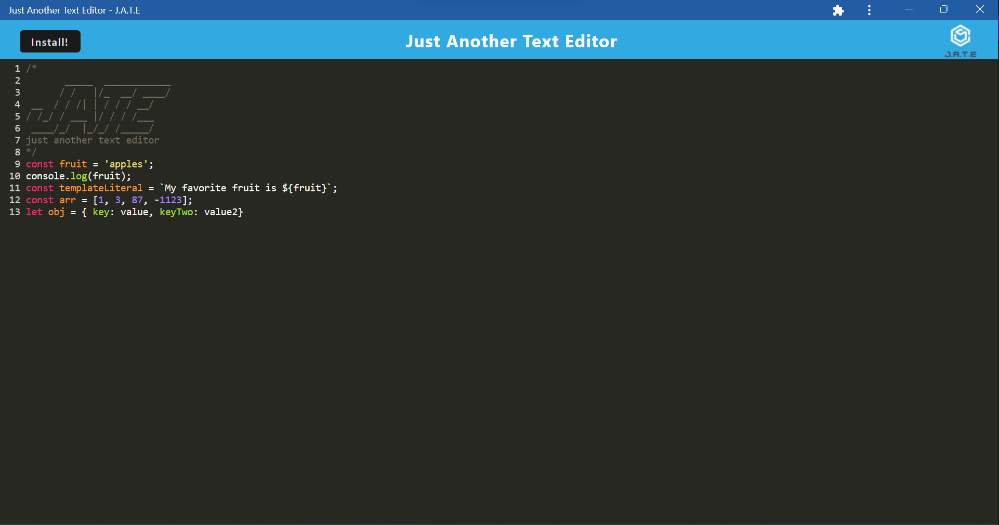

# Note Taker

## Description

- I create this basic text-editor app to practices working with webpack and workbox to create a functional PWA.
- The app itself is a simple text-editor with basic syntax highlighting that will persist date entered using the indexeddb.
- Being a PWA the app can be installed on your local machine and used offline.

## Table of Contents

- [Usage](#usage)
- [Credits](#credits)

## Usage

This application is deployed at:

[Heroku text-editor-app](https://text-editor-pwa-445577.herokuapp.com/)

The repo can be found at:

[github repo](https://github.com/andrewmuhn/text-editor)

To use this app:

Simply naviagte to the above URL. You can choose to use the application in the broswer. Just begin typing and your text will appear.

If you want to be able to use the app offline click the Install! button and follow the simple prompt to download the application on to your local machine. Then a simple Icon will appear on your desktop an you can navigate to the application on your machine and use the same way you would in the browser.

The desktop app icon:

The installed app:

In addition if you open the application in the broswer when you already have the app installed you can use the menu to open the downloaded app.

Any time you wish to uninstall just use the menu in the downloaded app and click Uninstall

## Credits

Project created by [Andrew Muhn](https://github.com/andrewmuhn)
as part of UofO Edx Bootcamp

Utilized:

- [node.js](https://nodejs.org/en/about)
- [Express](https://expressjs.com/)
- [Heroku](https://www.heroku.com/)
- [nodemon](https://nodemon.io/)
- [concurrently](https://github.com/open-cli-tools/concurrently#readme)
- [Babel](https://babeljs.io/)
- [webpack](https://webpack.js.org/)
- [Workbox](https://github.com/GoogleChrome/workbox)
